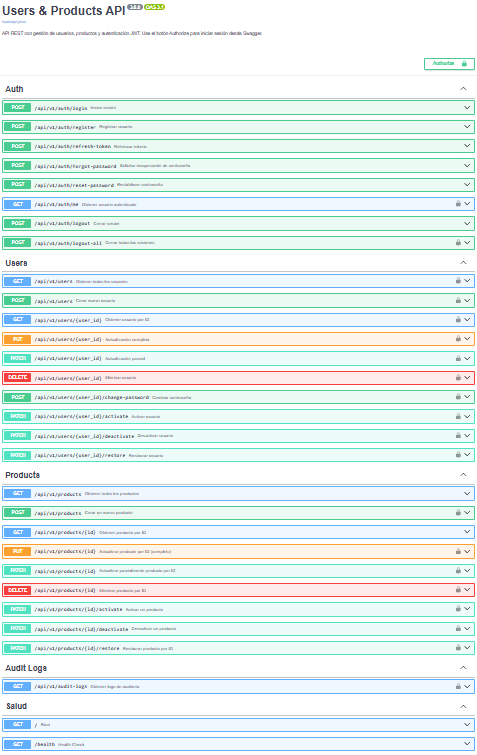

# FastAPI Users & Products JWT API

API REST desarrollada con FastAPI para gestión de usuarios y productos, autenticación JWT, control de acceso por roles, auditoría, manejo de sesiones con refresh tokens, recuperación de contraseña, rate limiting, limpieza manual de tokens, migraciones con Alembic, CI con GitHub Actions y despliegue con Docker.

## Descripción

Este proyecto implementa una API backend con arquitectura por capas, pensada para crecimiento, mantenimiento y validación continua. Incluye módulos de usuarios, productos y autenticación, documentación interactiva con Swagger, observabilidad mediante logs técnicos, auditoría persistida en PostgreSQL, migraciones reproducibles con Alembic, pruebas automatizadas y control de sesiones del lado del servidor mediante refresh tokens persistidos, rotados y revocables.

El desarrollo se realizó de forma incremental: primero la lógica de usuarios y productos, después autenticación y autorización, luego observabilidad y auditoría, más tarde la formalización del esquema con Alembic y CI, y finalmente el endurecimiento del flujo de sesión con rotación y revocación de refresh tokens, cierre global de sesiones, recuperación de contraseña, rate limiting en endpoints sensibles y limpieza manual de tokens obsoletos.

## Vista de la documentación interactiva

La API incluye documentación interactiva con Swagger, lo que permite explorar endpoints, probar flujos de autenticación y validar respuestas directamente desde el navegador.



## Características principales

### Usuarios

- Alta de usuarios
- Consulta individual y paginada
- Actualización completa y parcial
- Cambio de contraseña
- Activación y desactivación
- Eliminación lógica y restauración
- Restricción de campos privilegiados para usuarios normales
- Creación administrativa de usuarios por superusuario

### Productos

- Alta de productos
- Consulta individual y paginada
- Actualización completa y parcial
- Activación y desactivación
- Eliminación lógica y restauración
- Catálogo público sin exponer productos eliminados lógicamente
- Protección de operaciones administrativas para superusuario

### Seguridad y autenticación

- Registro público
- Login con JWT
- Access token y refresh token
- Endpoint `/api/v1/auth/me`
- Endpoint `/api/v1/auth/forgot-password`
- Endpoint `/api/v1/auth/reset-password`
- Integración con `Authorize` en Swagger
- Control de acceso por roles:
  - público
  - usuario autenticado
  - superusuario
- Endurecimiento del registro público para impedir autoelevación de privilegios
- Respuesta neutra en recuperación de contraseña para no exponer si un correo existe o no

### Gestión de sesiones

- Persistencia de refresh tokens en PostgreSQL
- Refresh tokens con identificador único (`jti`)
- Rotación de refresh tokens al renovar sesión
- Revocación explícita de refresh tokens
- Endpoint `/api/v1/auth/logout`
- Endpoint `/api/v1/auth/logout-all`
- Invalidación de refresh tokens revocados
- Cierre de todas las sesiones activas del usuario autenticado
- Revocación de sesiones activas tras restablecer contraseña
- Limpieza manual de tokens expirados o revocados antiguos mediante script

### Recuperación de contraseña

- Persistencia de `password_reset_tokens` en PostgreSQL
- Generación de token de recuperación
- Validación de token válido, no usado y no expirado
- Marcado del token como usado después del restablecimiento
- Restablecimiento de contraseña con revocación de refresh tokens activos
- Pruebas de integración para el flujo de recuperación

### Protección contra abuso

- Rate limiting configurable por entorno
- Límite aplicado a `POST /api/v1/auth/login`
- Límite aplicado a `POST /api/v1/auth/register`
- Infraestructura preparada para cambiar backend de almacenamiento sin hardcodeo
- Pruebas de integración para validar respuestas `429 Too Many Requests`

### Observabilidad y auditoría

- Configuración CORS
- Logs técnicos en archivo
- `request_id` por petición
- Header `X-Request-ID` en respuestas
- Auditoría persistida en PostgreSQL
- Endpoint protegido `GET /api/v1/audit-logs`
- Correlación entre logs técnicos y auditoría mediante `request_id`
- Auditoría de eventos sensibles como `login`, `refresh_token`, `logout`, `logout_all`, `forgot_password`, `reset_password` y operaciones administrativas sobre usuarios y productos

### Migraciones y persistencia

- Esquema versionado con Alembic
- Migración inicial real para reconstrucción desde base vacía
- Flujo reproducible con `revision --autogenerate` y `upgrade head`
- Arranque del contenedor con migraciones aplicadas antes de iniciar la API

### Calidad y validación

- Pruebas unitarias
- Pruebas de integración
- Ejecución reproducible dentro de Docker
- CI con GitHub Actions para migraciones y pruebas automáticas
- **329 pruebas aprobadas**
- **98% de cobertura global**

## Tecnologías utilizadas

- Python 3.12
- FastAPI
- SQLModel
- SQLAlchemy
- Alembic
- PostgreSQL
- JWT (`python-jose`)
- bcrypt
- SlowAPI
- limits
- Docker
- Docker Compose
- Swagger / OpenAPI
- pytest
- pytest-asyncio
- pytest-cov
- pytest-mock
- httpx
- GitHub Actions

## Arquitectura

El proyecto sigue una arquitectura por capas para separar responsabilidades y facilitar la evolución del sistema.

- `api/` → endpoints HTTP
- `schemas/` → validación y DTOs
- `services/` → lógica de negocio
- `repositories/` → acceso a datos
- `models/` → entidades de base de datos
- `core/` → configuración, seguridad, logging, base de datos, manejo de errores y rate limiting
- `scripts/` → comandos manuales de mantenimiento

## Estructura del proyecto

```text
app/
├── api/
│   └── v1/
│       ├── api.py
│       └── endpoints/
│           ├── audit_logs.py
│           ├── auth.py
│           ├── products.py
│           └── users.py
├── core/
│   ├── config.py
│   ├── database.py
│   ├── logging_config.py
│   ├── rate_limit.py
│   ├── request_logging_middleware.py
│   ├── security.py
│   ├── exceptions/
│   └── handlers/
├── models/
│   ├── __init__.py
│   ├── audit_log.py
│   ├── password_reset_token.py
│   ├── product.py
│   ├── refresh_token.py
│   └── user.py
├── repositories/
│   ├── audit_log_repository.py
│   ├── base.py
│   ├── password_reset_token_repository.py
│   ├── product_repository.py
│   ├── refresh_token_repository.py
│   └── user_repository.py
├── schemas/
│   ├── audit_log.py
│   ├── auth.py
│   ├── common.py
│   ├── product.py
│   ├── response.py
│   └── user.py
├── scripts/
│   ├── __init__.py
│   └── cleanup_refresh_tokens.py
├── services/
│   ├── __init__.py
│   ├── audit_log_service.py
│   ├── auth_service.py
│   ├── password_reset_token_service.py
│   ├── product_service.py
│   ├── refresh_token_service.py
│   ├── token_service.py
│   └── user_service.py
├── dependencies.py
└── main.py

alembic/
├── env.py
└── versions/

docker/
└── fastapi/
    └── Dockerfile

.github/
├── workflows/
│   └── ci.yml
└── PULL_REQUEST_TEMPLATE.md

docs/
├── DEPLOY_CHECKLIST.md
├── QUICKSTART.md
└── images/
    └── swagger-ui.png

tests/
├── integration/
├── unit/
├── test_connection.py
├── test_db.py
└── test_models.py

docker-compose.yml
alembic.ini
pytest.ini
requirements.txt
requirements-dev.txt
.env.example
.gitignore
CONTRIBUTING.md
LICENSE
README.md
````

## Endpoints principales

### Auth

* `POST /api/v1/auth/register`
* `POST /api/v1/auth/login`
* `POST /api/v1/auth/refresh-token`
* `POST /api/v1/auth/logout`
* `POST /api/v1/auth/logout-all`
* `POST /api/v1/auth/forgot-password`
* `POST /api/v1/auth/reset-password`
* `GET /api/v1/auth/me`

### Users

* `GET /api/v1/users`
* `GET /api/v1/users/{user_id}`
* `POST /api/v1/users`
* `PUT /api/v1/users/{user_id}`
* `PATCH /api/v1/users/{user_id}`
* `POST /api/v1/users/{user_id}/change-password`
* `PATCH /api/v1/users/{user_id}/activate`
* `PATCH /api/v1/users/{user_id}/deactivate`
* `DELETE /api/v1/users/{user_id}`
* `PATCH /api/v1/users/{user_id}/restore`

### Products

* `GET /api/v1/products`
* `GET /api/v1/products/{id}`
* `POST /api/v1/products`
* `PUT /api/v1/products/{id}`
* `PATCH /api/v1/products/{id}`
* `PATCH /api/v1/products/{id}/activate`
* `PATCH /api/v1/products/{id}/deactivate`
* `DELETE /api/v1/products/{id}`
* `PATCH /api/v1/products/{id}/restore`

### Audit Logs

* `GET /api/v1/audit-logs`

## Ejecución con Docker

### 1. Clonar el repositorio

```bash
git clone <URL_DEL_REPOSITORIO>
cd fastapi-users-products-jwt-api
```

### 2. Crear el archivo `.env`

```bash
cp .env.example .env
```

En PowerShell:

```powershell
Copy-Item .env.example .env
```

### 3. Levantar servicios

```bash
docker compose up -d --build
```

La configuración actual ejecuta las migraciones con Alembic antes de iniciar la aplicación dentro del contenedor.

### 4. Acceder a la API

* Swagger UI: `http://localhost:8000/docs`
* Health check: `http://localhost:8000/health`

## Ejecución local

```bash
python -m venv .venv
pip install -r requirements.txt -r requirements-dev.txt
alembic upgrade head
python -m uvicorn app.main:app --reload
```

## Variables de entorno principales

* `PROJECT_NAME`
* `VERSION`
* `DEBUG`
* `ENVIRONMENT`
* `API_V1_STR`
* `POSTGRES_USER`
* `POSTGRES_PASSWORD`
* `POSTGRES_DB`
* `POSTGRES_HOST`
* `POSTGRES_PORT`
* `DATABASE_URL`
* `APP_PORT`
* `SECRET_KEY`
* `ALGORITHM`
* `ACCESS_TOKEN_EXPIRE_MINUTES`
* `REFRESH_TOKEN_EXPIRE_DAYS`
* `DEFAULT_PAGE_SIZE`
* `MAX_PAGE_SIZE`
* `BACKEND_CORS_ORIGINS`
* `LOG_DIR`
* `RATE_LIMIT_ENABLED`
* `RATE_LIMIT_STORAGE_URI`
* `RATE_LIMIT_HEADERS_ENABLED`
* `RATE_LIMIT_DEFAULTS`
* `RATE_LIMIT_LOGIN`
* `RATE_LIMIT_REGISTER`

## Logs técnicos

La aplicación genera:

* `logs/technical.log`
* `logs/error.log`

Cada request registra, entre otros datos:

* `request_id`
* método HTTP
* ruta
* status code
* latencia
* IP cliente

## Logs de auditoría

La tabla `audit_logs` registra eventos sensibles como:

* `register`
* `login`
* `refresh_token`
* `logout`
* `logout_all`
* `forgot_password`
* `reset_password`
* `create_user`
* `update_user`
* `partial_update_user`
* `change_password`
* `activate_user`
* `deactivate_user`
* `delete_user`
* `restore_user`
* `create_product`
* `update_product`
* `partial_update_product`
* `activate_product`
* `deactivate_product`
* `delete_product`
* `restore_product`

Cada evento conserva acción, entidad, actor, rol, `request_id`, estado, detalle y fecha.

## Migraciones con Alembic

Flujo de trabajo:

```bash
alembic revision --autogenerate -m "descripcion del cambio"
alembic upgrade head
alembic current
```

## Limpieza manual de refresh tokens

El proyecto incluye un script para borrar refresh tokens expirados o revocados antiguos.

Ejecución básica:

```bash
docker compose exec api python -m app.scripts.cleanup_refresh_tokens
```

Con antigüedad personalizada para tokens revocados:

```bash
docker compose exec api python -m app.scripts.cleanup_refresh_tokens --revoked-older-than-days 15
```

El script elimina:

* refresh tokens expirados
* refresh tokens revocados hace más de `N` días

## Pruebas

Ejecutar toda la batería:

```bash
docker compose exec api pytest tests/unit tests/integration -q
```

Con reporte de cobertura:

```bash
docker compose exec api pytest tests/unit tests/integration --cov=app --cov-report=term-missing
```

Estado actual:

* **329 pruebas aprobadas**
* **98% de cobertura global**

## Documentación operativa

Además del README, el repositorio incluye:

* `CONTRIBUTING.md` para reglas básicas de colaboración
* `docs/QUICKSTART.md` para arranque rápido del proyecto
* `docs/DEPLOY_CHECKLIST.md` para validación previa a despliegue
* `.github/PULL_REQUEST_TEMPLATE.md` para estandarizar futuros Pull Requests

## CI

El proyecto incluye un workflow de GitHub Actions para:

* instalar dependencias
* levantar PostgreSQL en CI
* ejecutar migraciones con Alembic
* correr pruebas unitarias e integración
* reducir corridas duplicadas con control de concurrencia

## Licencia

Este proyecto se distribuye bajo licencia MIT. Consulta el archivo `LICENSE` para más detalles.

## Estado del proyecto

El proyecto se encuentra en un estado funcional y consolidado. La base principal del backend ya está implementada, cubierta con pruebas automatizadas y documentada. Los pendientes restantes son incrementales y no bloquean el uso del proyecto como muestra técnica ni como base para seguir ampliando funcionalidades.

## Siguientes pasos

* integración de envío real de correo para recuperación de contraseña
* ampliación de módulos de negocio
* endurecimiento adicional de seguridad sobre autenticación y abuso
* refinamientos menores de observabilidad y despliegue

## Autor

Prashanti Peña Guevara

Proyecto backend orientado a construir una API escalable, mantenible y más cercana a un entorno real de desarrollo.

